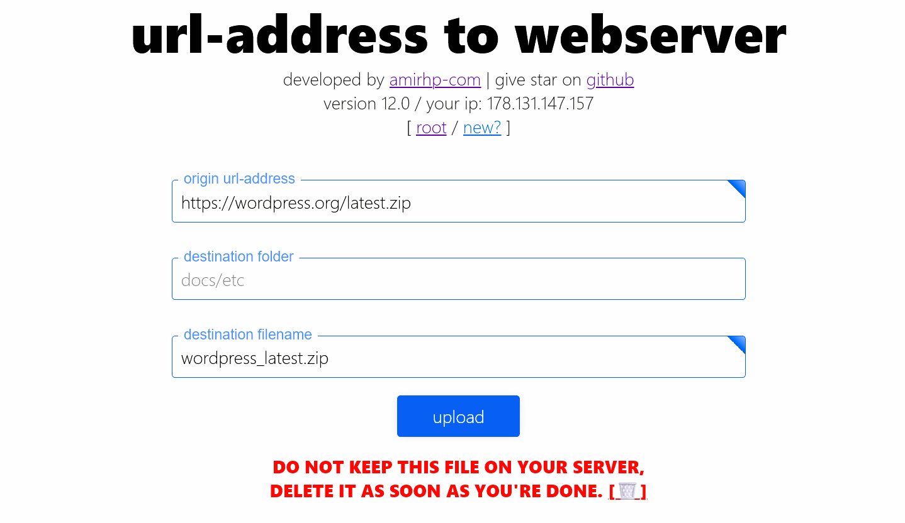

# **Upload File from URL to Web Server v.13**

&nbsp;

A simple and efficient solution for uploading files directly from a URL to your web server (e.g., CPanel). This tool is perfect for quick tasks where you need to download and store files on your hosting environment with minimal effort.

**Latest Publish Date:** 2024/08/18 (1403/05/28)

## Features

- **One-Click Upload:** Effortlessly upload files from a URL to your hosting storage.
- **Self-Destruct Feature:** The script can self-destruct after use, enhancing security.
- **Auto File-Name Filler:** Automatically suggests a file name based on the URL.
- **Back to Root Button:** Quickly navigate back to the root directory after upload.
- **Timer Display:** Shows the elapsed and total time for each upload.
- **Real-Time Progress:** Monitor the upload process in real-time.
- **Compatibility:** Works seamlessly with both SSL and Non-SSL environments, including DirectAdmin hosting.

## Installation Guide

1. **Download** the `upload.php` file from the repository.
2. **Upload** the `upload.php` file to your desired directory on your web server (e.g., CPanel or DirectAdmin).
3. **Access the Tool:** Open the `upload.php` file in your web browser by navigating to its location on your server.
4. **Upload a File:**
   - Paste the URL of the file you want to upload.
   - Optionally, provide a custom file name.
   - Click the "UPLOAD" button to start the process.

## How to Contribute

Contributions are welcome! If you'd like to improve the script, add new features, or fix bugs:

1. **Fork** the repository.
2. **Create a new branch** for your feature or bug fix.
3. **Make your changes** and ensure they are tested.
4. **Submit a pull request** with a clear description of the changes you've made.

## License

This project is licensed under the MIT License. See the [LICENSE](LICENSE) file for details.

## Disclaimer

This tool is provided as-is, and is intended for personal use only. The author takes no responsibility for any misuse, damage, or security vulnerabilities that may arise from using this script. Use it at your own risk, and ensure that you remove the script from your server after use to prevent unauthorized access.

## Changelog:

-   Version 13: Added Self Destruct feature
-   Version 12: Added New features and stability.
-   Version 08: Added Compatibility with NON-SSL and DirectAdmin hosting
-   Version 07: Added Auto file-name filler and Back to Root button
-   Version 06: Added Timer, showing elapsed and total time
-   Version 05: More stability on large files processing
-   Version 04: Fixed get file size error
-   Version 03: Added Some styling and visuals
-   Version 02: Added Real-time progress while uploading
-   Version 01: Initiate release, at 2020/11/15 - 1399/08/25