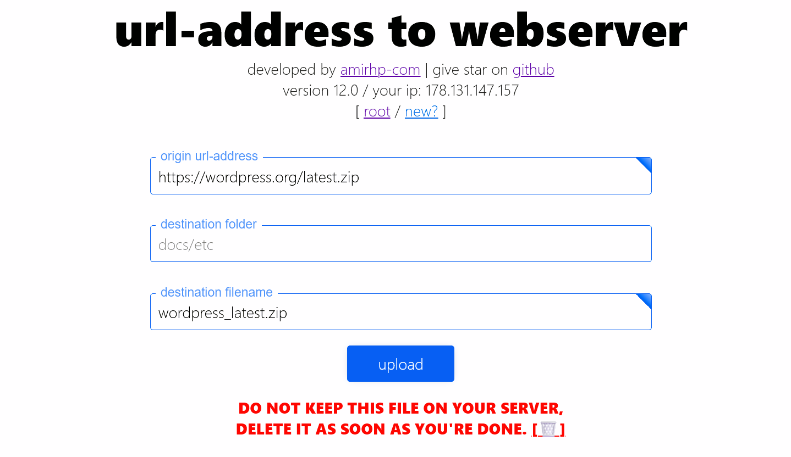
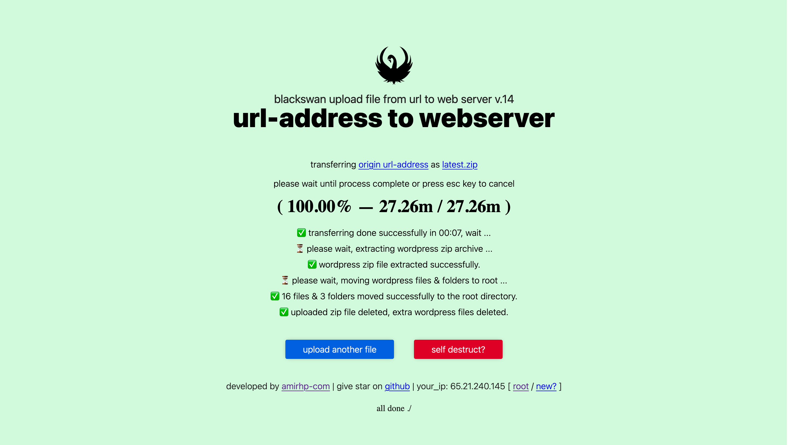

# BlackSwan — Upload File from URL to Web Server

> A single-file PHP utility that pulls any file from a remote URL straight onto your web server, with live progress, optional archive extraction, a built-in WordPress installer, and a one-click self-destruct.

**Latest release:** v18 · 2026-04-29 (1405-02-09)
**Single file:** `upload.php` — drop it in, run it, delete it.
**Zero dependencies:** pure PHP, vanilla JS, vanilla CSS. No Composer, no CDN, no build step.

---

## Why this exists

Sometimes you need to get a file *onto* a server but `wget` and `ssh` aren't available — shared hosting, locked-down cPanel, DirectAdmin, a managed WordPress host. You have FTP and a URL. That's it.

`upload.php` bridges the gap: upload **this one file**, point it at any URL, and the server pulls the file directly. No more "download to laptop → upload via FTP" detours for a 2 GB archive.

## Features

- **Direct URL → server transfer** with live progress, file-size readout, and elapsed time.
- **cURL-based engine** — works on SSL, non-SSL, DirectAdmin, follows redirects, 64 KB buffer, throttled UI updates.
- **Universal archive extraction** (toggle): `.zip`, `.tar`, `.tar.gz`, `.tgz`, `.gz`.
- **WordPress installer mode** (toggle): downloads, extracts, moves to root, keeps only the latest default theme, wipes default plugins, writes a `Disallow: /` `robots.txt`.
- **Copy-to-clipboard** buttons for source and destination URL on the completion screen, with toast confirmation.
- **PHP Info panel** — curated server diagnostics (`?info=1`) plus full `phpinfo()` (`?phpinfo=1`).
- **iOS-style toggles**, mobile-responsive form, keyboard-accessible.
- **Self-destruct** — one click and the script removes itself from the server.
- **Path-traversal hardening** on folder and filename inputs.
- **Auto file-name** suggested from the URL.
- **Back-to-root** and **Upload another** quick links after each transfer.

## Requirements

- PHP **7.0+** (tested up to 8.x).
- `cURL` extension (almost always enabled).
- `ZipArchive` extension for `.zip` extraction.
- `PharData` extension (bundled with PHP) for `.tar` / `.tar.gz` / `.tgz`.
- Write permissions in the directory where `upload.php` lives.

## Installation

1. **Download** [`upload.php`](upload.php).
2. **Upload** it via FTP/SFTP/cPanel File Manager to the directory where you want the destination file to land (typically your web root or a target folder).
3. **Open** it in your browser: `https://yoursite.com/upload.php`.
4. **Paste** the source URL, set the destination filename and (optionally) a subfolder.
5. **Toggle** "Extract archive" or "WordPress installer" if you need them.
6. Click **upload** and watch the progress bar.
7. When done, **click "Self Destruct?"** — or visit `?delete=true` directly — to remove the script.

## Usage tips

- **WordPress in two clicks**: leave the default URL (`https://wordpress.org/latest.zip`), enable the **WordPress installer** toggle, hit upload. You'll get a clean WordPress install at the document root with one default theme, no default plugins, and a `robots.txt` blocking all crawlers.
- **Generic archive**: enable just the **Extract archive** toggle. The format is detected from the filename extension.
- **Subfolder uploads**: type `path/to/subfolder` in the destination folder field. The folder is created if it doesn't exist. Path-traversal sequences (`..`) are stripped automatically.
- **Server diagnostics**: click **PHP Info** in the header (or hit `?info=1`) to see PHP version, loaded extensions, memory/upload limits, disk space, and key `$_SERVER` values without exposing full `phpinfo()`.

## URL endpoints

| URL                  | Action                                                       |
| -------------------- | ------------------------------------------------------------ |
| `upload.php`         | Main upload form.                                             |
| `upload.php?info=1`  | Curated server / PHP info panel.                              |
| `upload.php?phpinfo=1` | Full native `phpinfo()` output.                             |
| `upload.php?delete=true` | Self-destruct — deletes the script from the server.       |
| `upload.php?r=…`     | Cache-busting reload of the form.                             |

## Security notes

> This tool is **intentionally permissive** — it is designed to be uploaded, used, and immediately deleted. Treat it as a temporary utility, not as part of your application.

- **Always self-destruct** when you're done. If you forget, anyone who finds the URL can pull arbitrary files onto your server.
- The script does **not** ship with auth. If you need protection during a slow upload, drop a `.htaccess` Basic Auth gate next to it, or rename the file to something unguessable.
- The page itself is `<meta name="robots" content="noindex,nofollow">` and (in WordPress mode) writes a `Disallow: /` `robots.txt` to the site root.
- File and folder inputs are sanitised against `..`, null bytes, mixed slashes, and leading separators.

## Changelog

Full history: [CHANGELOG.md](CHANGELOG.md).

Recent highlights:

- **v18** — Inline SVG icon, scoped `delete_file` action with realpath safety, output-buffer padding for proxied hosts. ([details](CHANGELOG.md#v18))
- **v17** *(unreleased — folded into v18)* — cURL-based download engine, iOS-style toggles, universal archive extraction (zip/tar/tar.gz/tgz/gz), copy buttons + toast, PHP info panel, hardened path validation, mobile-responsive form, WordPress installer with theme/plugin cleanup and `robots.txt`. ([details](CHANGELOG.md#v17-unreleased--superseded-by-v18))
- **v16** — `delete_file` action, `?force=1` cURL switch, inline SVG favicon, periodic output padding.
- **v14** — WordPress installer mode, self-destruct on finish screen.
- **v13** — Self-destruct feature.
- **v8** — DirectAdmin / non-SSL fallback path.

## Contributing

Pull requests are welcome.

1. Fork the repo.
2. Branch off `main`.
3. Keep the file count low — this project is deliberately a **single file**. New features should land inside `upload.php` unless there's a strong reason to split.
4. Update `CHANGELOG.md` under a new version section.
5. Open a PR with a clear description and (if UI changes) a screenshot.

## License

MIT — see [LICENSE](LICENSE).

## Disclaimer

Provided as-is. The author accepts no responsibility for misuse, lost data, or security incidents resulting from leaving this script accessible on a production server. Self-destruct it the moment you're done.

---

Built by [amirhp-com](https://amirhp.com/) · Star it on [GitHub](https://github.com/amirhp-com/upload-file-from-url-to-webserver).
